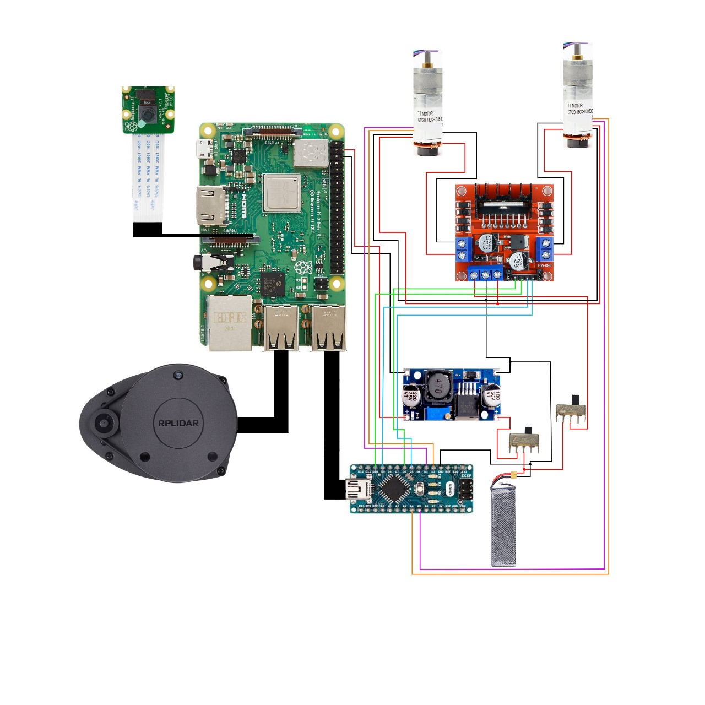

# Project-ARIA
## Introduction

Inefficiencies and safety risks in warehouses, healthcare, public spaces, manufacturing, infrastructure, and agriculture arise from reliance on manual and semi-automated systems. These systems lead to higher labor costs, operational delays, and errors. Advanced autonomous navigation solutions are needed to streamline operations, enhance accuracy, ensure safety, and improve scalability. Implementing such technology can significantly reduce operational costs, enhance the quality of service, and boost productivity across these sectors.

## Overview

Our solution is a ROS-based autonomous navigation robot designed for versatile applications across various industries. It utilizes advanced sensors and algorithms to navigate indoor environments such as warehouses, hospitals, public spaces, manufacturing facilities, and agricultural sites. By automating routine tasks, our robot enhances operational efficiency, reduces human error, and improves safety. Its innovative design allows for seamless integration into existing workflows, scalable deployment, and adaptability to different use cases, making it a comprehensive solution for improving productivity and service quality across multiple sectors.

## Table of Contents

- [Demo]()
- [Components](#Components-required-with-Bill-of-Materials)
- [Circuit](#Pinout-Diagram)
- [Code Base](#)
- [Technologies Used](#technologies-used)
- [Packages Used](#packages-used)
- [Getting Started](#getting-started)
- [Folder Structure](#folder-structure)
- [Running the Application](#running-the-application)
- [Authors](#authors)
- [Result](#Result)
- [Conclusions](#Conclusions)

## Demo
### Demo Videos
### Progress Images
#### Simulation 

Fig : Image of custom warehouse  

Fig : Map of warehouse genrated by SLAM Toolkit
#### Physical Prototype

## Components required with Bill of Materials
### Components That are Already  Acquired / Owned :

| Component                | Quantity | Description                                                            | Links to Products                  |
|--------------------------|----------|------------------------------------------------------------------------|------------------------------------|
| Raspberry Pi 3b+         | 1        | Microprocessor Board                                                   | [Raspberry Pi 3b+](https://www.raspberrypi.org/products/raspberry-pi-3-model-b-plus/) |
| Pi cam                   | 1        | Standard Pi Cam for Surveillance                                       | [Pi camera](https://www.raspberrypi.org/products/camera-module-v2/) |
| Buck Converter           | 1        | Step down or Step up Voltage device                                    | [Buck Converter](https://www.amazon.com/LM2596-Converter-Power-Supply-Module/dp/B00C0KL1OM) |
| Li-Po battery            | 1        | 11.5V Li-Po battery for Power Requirements                             | [LiPo battery 3s](https://www.amazon.com/11-1V-2200mAh-LiPo-Battery/dp/B07RJD53Z9) |
| Lidar                    | 1        | RP Lidar A1M8 For Mapping the required area                            | [Lidar A1M8](https://www.slamtec.com/en/Lidar/A1) |
| Caster wheel             | 1        | For Smooth running and weight Balancing of the Bot                     | [Castor wheel](https://www.amazon.com/Caster-Wheels/s?k=Caster+Wheels) |
| Motor Driver             | 1        | L298N Motor Driver to Run the Motors                                   | [Motor Driver](https://www.amazon.com/HiLetgo-Controller-Stepper-Heatsink-Arduino/dp/B00J4Z6892) |
| Arduino Nano             | 1        | Microcontroller board for Sending the signal from Pi to Motor driver   | [Arduino Nano](https://store.arduino.cc/products/arduino-nano) |
| Slide Switches           | 2        | Switches for Powering Up or Down the Bot                               | [Slide Switch](https://www.amazon.com/Slide-Switches/s?k=Slide+Switches) |
| Wheels                   | 2        | To Run the Bot Forward, Reverse or in Required Direction               | [Wheels](https://www.amazon.com/Robot-Wheels/s?k=Robot+Wheels) |

### Components to be Acquired

| Component                | Quantity | Description                                                            | Links to Products                  |
|--------------------------|----------|------------------------------------------------------------------------|------------------------------------|
| Gear Motor Encoder D type| 2        | Gear motor Encoder D type to maintain or equalize the Speed of Motors  | [Encoded Motors](https://www.amazon.com/DC-Geared-Motor-Encoder-Robot/dp/B07Y3N1CVX) |
| Cooling system           | 1        | Raspberry Pi Cooling system (aluminum case with Double fans)           | [Cooling System](https://www.amazon.com/Raspberry-Aluminum-Heatsink-Cooling-Cooler/dp/B07349HT26) |

## Pinout Diagram

### Table for Pin Connections

| Component                    | Pin Configuration          | Description                                                                      |
|------------------------------|----------------------------|----------------------------------------------------------------------------------|
| RP Lidar A1M8 Micro USB Port | USB Port 2                 | Lidar Connected to the Raspberry Pi’s USB Port 2                                 |
| Arduino Nano Micro USB Port  | USB Port 1                 | Nano Connected to the Raspberry Pi’s USB Port 1                                  |
| Pi camera                    | CSI Camera Port            | Camera Connected to the Raspberry Pi’s Camera port                               |
| Motor Driver control pin 1   | PD6                        | CP1 of Motor driver connection to Microcontroller Nano                           |
| Motor Driver control pin 2   | PD10                       | CP2 of Motor driver connection to Microcontroller Nano                           |
| Motor Driver control pin 3   | PD9                        | CP3 of Motor driver connection to Microcontroller Nano                           |
| Motor Driver control pin 4   | PD5                        | CP4 of Motor driver connection to Microcontroller Nano                           |
| Motor Driver 5V out          | Vin                        | Power supply to Arduino Nano from Motor Driver                                   |
| Encoder Motor1 +ve           | OUT1                       | Motor1 Connections to Driver (To run the motor)                                  |
| Encoder Motor1 -ve           | OUT2                       | Motor1 Connections to Driver                                                     |
| Encoder Motor1 VCC           | 5v out                     | Power supply for E.motor from MotorDriver                                        |
| M1 Encoder A (interrupt)     | PC4                        | Connections to pin A4 of Microcontroller to determine the Speed of motor          |
| M1 Encoder B (direction)     | PC5                        | Connections to pin A5 of Microcontroller to determine the Direction and position of Motor |
| Encoder Motor2 +ve           | OUT3                       | Motor2 Connections to Driver                                                     |
| Encoder Motor2 -ve           | OUT4                       | Motor2 Connections to Driver                                                     |
| Encoder Motor2 VCC           | 5v out                     | Power supply for E.motor from MotorDriver                                        |
| M2 Encoder A (interrupt)     | PD2                        | Connections to pin D2 of Microcontroller to determine the Speed of motor          |
| M2 Encoder B (direction)     | PD3                        | Connections to pin D3 of Microcontroller to determine the Direction and position of Motor |
| GND pins of Encoder Motors   | GND                        | Connections to GND pin of Motor driver                                           |
| Buck converter out +         | 5v Vin                     | Reduced voltage power supply from BC to Pi                                       |
| Li-Po Battery +ve            | 12v Vin of MD, In+ of BC   | Supplying equal power to both Motor Driver and BC by making it short             |
| GND Pins                     | Common Ground              | All the GND Pins are shorted to make One common Ground                           |

## Result
## Conclusions
