# Project-ARIA for SemiCon 2024 VLSI System Design (VSD)
# Autonomous Robotic Integration for Automation
## Introduction
<p align="justify">
Inefficiencies and safety risks in warehouses, healthcare, public spaces, manufacturing, infrastructure, and agriculture arise from reliance on manual and semi-automated systems. These systems lead to higher labor costs, operational delays, and errors. Advanced autonomous navigation solutions are needed to streamline operations, enhance accuracy, ensure safety, and improve scalability. Implementing such technology can significantly reduce operational costs, enhance the quality of service, and boost productivity across these sectors.

## Overview
<p align="justify">
Our solution is a ROS-based autonomous navigation robot designed for versatile applications across various industries. It utilizes advanced sensors and algorithms to navigate indoor environments such as warehouses, hospitals, public spaces, manufacturing facilities, and agricultural sites. By automating routine tasks, our robot enhances operational efficiency, reduces human error, and improves safety. Its innovative design allows for seamless integration into existing workflows, scalable deployment, and adaptability to different use cases, making it a comprehensive solution for improving productivity and service quality across multiple sectors.

### SemiCon Demo

https://github.com/user-attachments/assets/424f8ee9-434c-47ae-aa84-b2928590af5a
<p align="center"><b>SemiCon Demo</b></p>

### Pinout Diagram updated with VSDSQUADRON Mini
<p align="center">
  
</p>

### VSDSQUADRON Mini Code  

<p align="center">
  <a href="https://github.com/AshishRamesh/Project-ARIA/tree/Semicon_VSD/source_code/VSD_Code">View VSDSQUADRON Mini Code</a>
</p>

https://github.com/user-attachments/assets/005c7e4c-dd3b-4236-9647-8dda58c89fea
<p align="center"><b>Ball Track Demo</b></p>

<p align="center">
  
</p>

<p align="center">
  
</p>

<p align="center">
  
</p>

<p align="center">
  
</p>


## Table of Contents

- [Demo](#Demo)
- [Components](#Components-required-with-Bill-of-Materials)
- [Hardware](#Hardware)
- [Code Base](#Code-Base)
- [Technologies Used](#Technologies-Used)
- [Folder Structure](#Folder-Structure)
- [Running A.R.I.A](#Running-A.R.I.A)
- [Result](#Result)
- [Conclusions](#Conclusions)

## Demo
### Demo Videos

### Simulation Demo

https://github.com/AshishRamesh/Project-ARIA/assets/81244883/e79a8316-d9ba-47e1-9f22-4ec968c25e12
<p align="center"><b>Simulation Demo</b></p>

### Physical Demo

https://github.com/user-attachments/assets/dfa1f675-97e4-41e5-b691-c56bd6adf495
<p align="center"><b>Physical Demo</b></p>

https://github.com/user-attachments/assets/36f9bdfe-767a-4070-a45c-221e4a039a4b
<p align="center"><b>Real Time Lidar Data in GUI</b></p>

https://github.com/user-attachments/assets/80d79d3a-1c21-490b-bc42-bdcebb4df903
<p align="center"><b>Real Time Mapping</b></p>

https://github.com/user-attachments/assets/6ad9fff8-bf34-49b5-b9a1-08f77d7b5e61
<p align="center"><b>Real Time Autonomous Navigation</b></p>

### Progress Images
### Simulation 

<p align="center">
  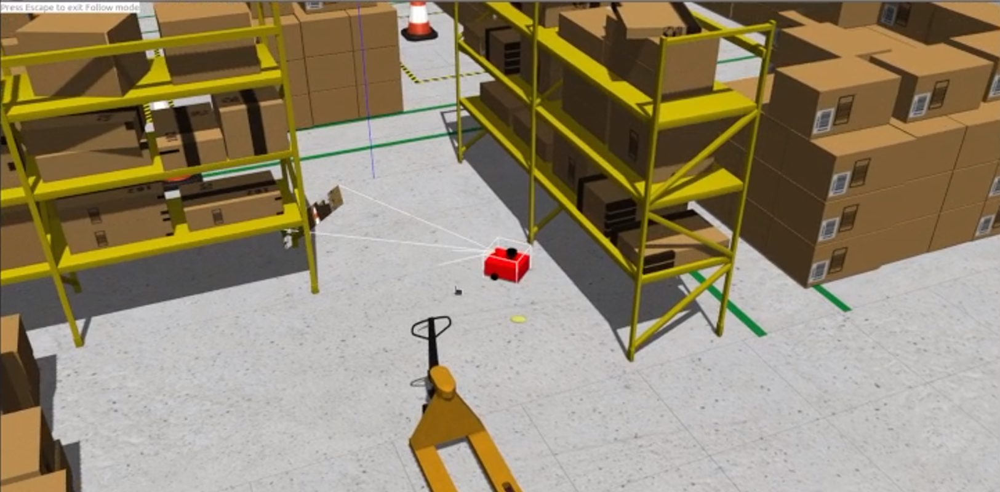
</p>
<p align="center"><b>Fig: Image of ARIA in Simulation</b></p>

<p align="center">
  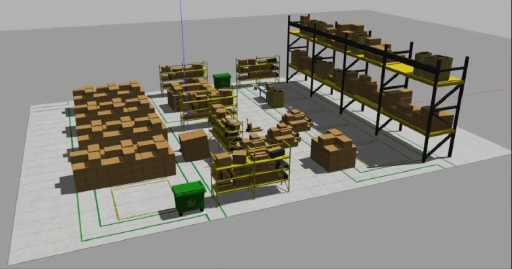
</p>
<p align="center"><b>Fig: Image of custom warehouse</b></p>

<p align="center">
  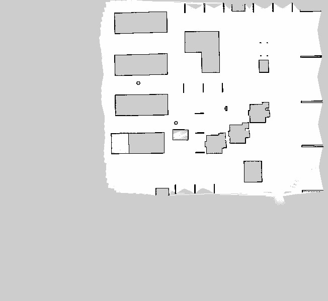
</p>
<p align="center"><b>Fig: Map of warehouse generated by SLAM Toolkit</b></p>

### Physical Prototype
<p align="center">
  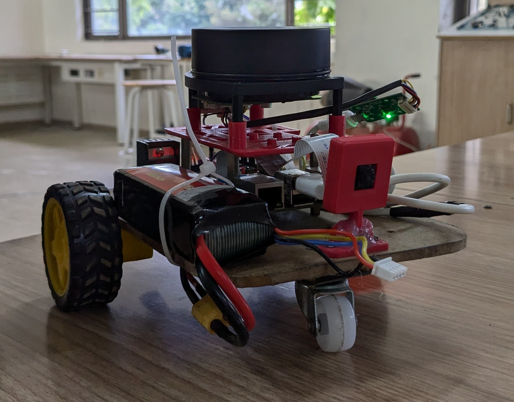
</p>
<p align="center"><b>Fig: Initial Prototype</b></p>

<p align="center">
  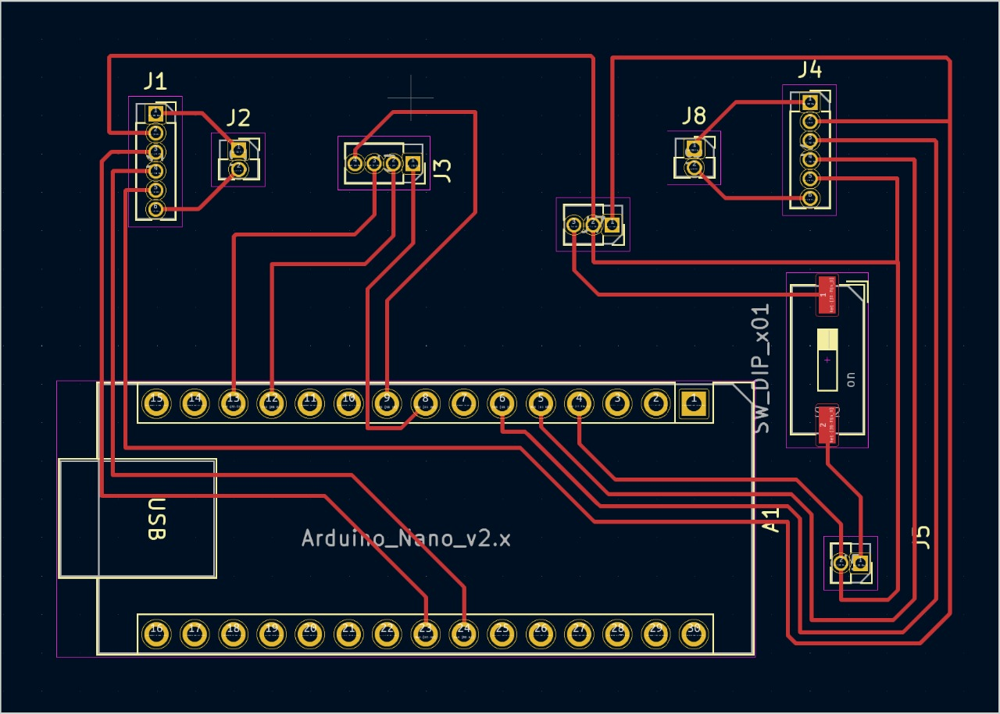
</p>
<p align="center"><b>Fig: Custom PCB for Nano & Motor Driver</b></p>

<p align="center">
  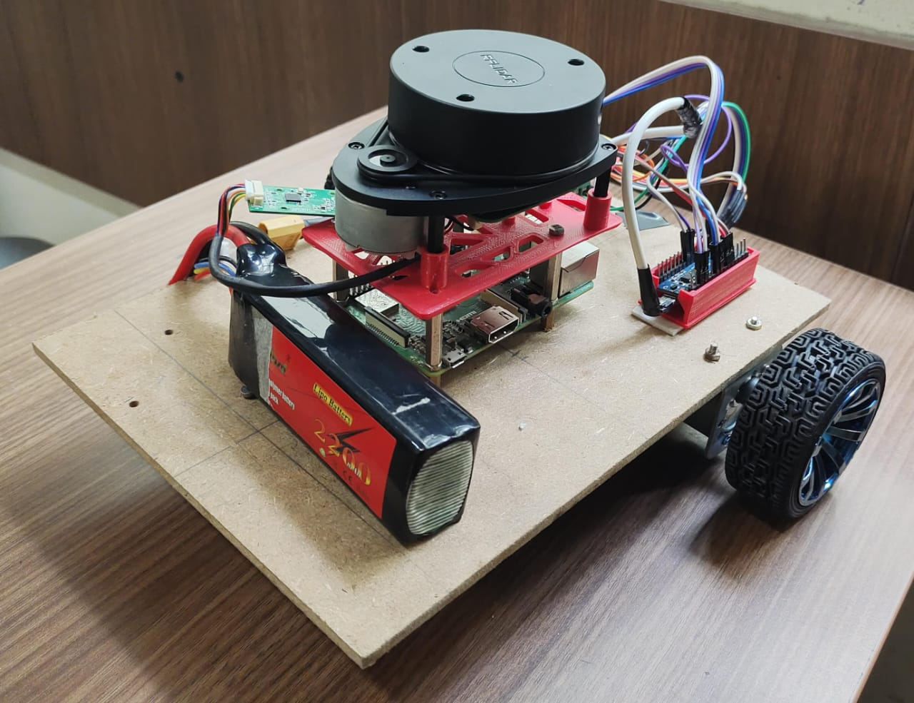
</p>
<p align="center"><b>Fig: ARIA Version 2 Chassis Base </b></p>

<p align="center">
  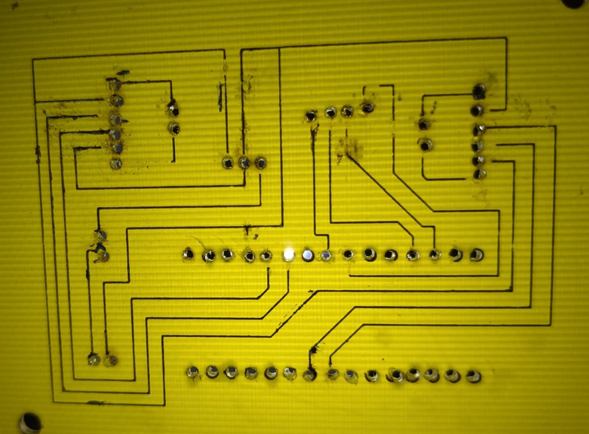
</p>
<p align="center"><b>Fig: Physical PCB </b></p>

<p align="center">
  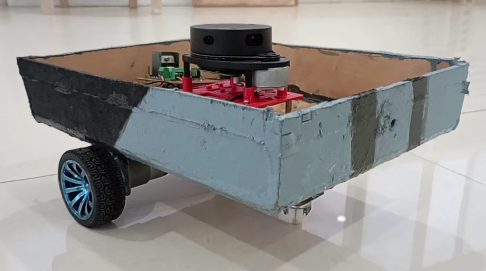
</p>
<p align="center"><b>Fig: ARIA Version 2 (Without Top Cover)  </b></p>

<p align="center">
  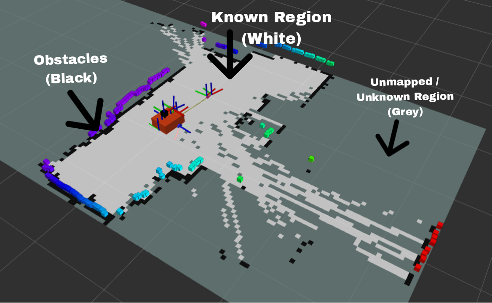
</p>
<p align="center"><b>Fig: Map generated in Real Environment </b></p>

<p align="center">
  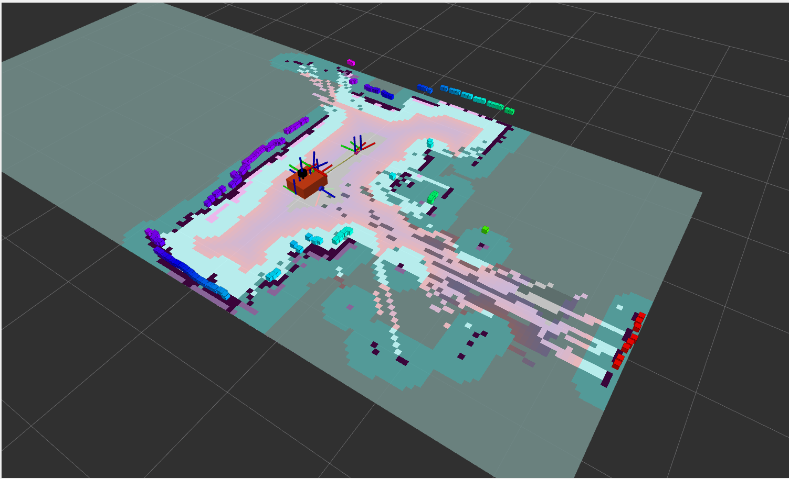
</p>
<p align="center"><b>Fig: Cost Map for Autonomous Navigation </b></p>

<p align="center">
  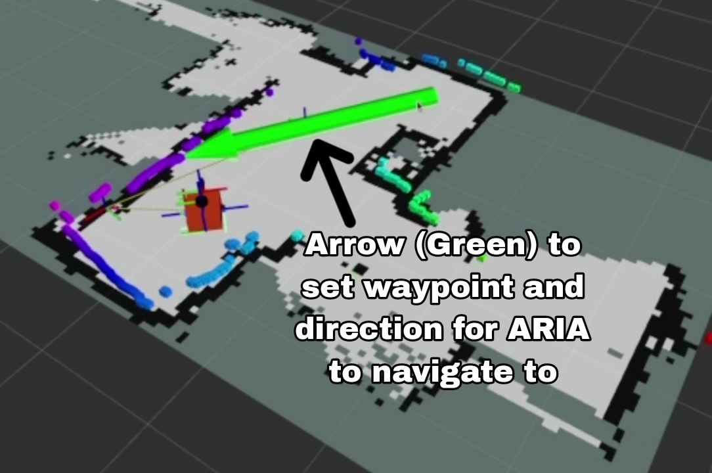
</p>
<p align="center"><b>Fig: Marker to set Waypoint for ARIA To Navigate to </b></p>

<p align="center">
  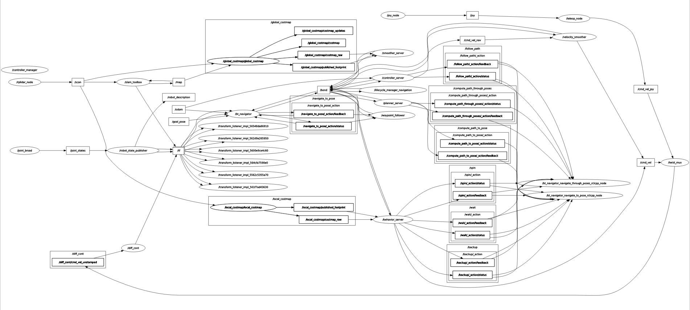
</p>
<p align="center"><b>Fig: Graph of all the communication taking place between PI, dev Machine, different sensors & Controller </b></p>

## Components required with Bill of Materials
### Components That are Already  Acquired / Owned :

| Component                | Quantity | Description                                                            | Links to Products                  |
|--------------------------|----------|------------------------------------------------------------------------|------------------------------------|
| VSDSquadron mini | 1        | Microcontroller board for Sending the signal from Nano to Motor driver  | [VSDSquadron Mini](https://www.vlsisystemdesign.com/vsdsquadronmini/) |
| Raspberry Pi 3b+         | 1        | Microprocessor Board                                                   | [Raspberry Pi 3b+](https://www.raspberrypi.org/products/raspberry-pi-3-model-b-plus/) |
| Arduino Nano | 1        | Microcontroller board for Sending the signal from Pi to VSDSquadron mini  | [Arduino Nano](https://store-usa.arduino.cc/products/arduino-nano) |
| Pi cam                   | 1        | Standard Pi Cam for Surveillance                                       | [Pi camera](https://www.raspberrypi.org/products/camera-module-v2/) |
| Buck Converter           | 1        | Step down or Step up Voltage device                                    | [Buck Converter](https://www.amazon.com/LM2596-Converter-Power-Supply-Module/dp/B00C0KL1OM) |
| Li-Po battery            | 1        | 11.5V Li-Po battery for Power Requirements                             | [LiPo battery 3s](https://robu.in/product/orange-2200mah-3s-30c60c-lithium-polymer-battery-pack-lipo/?gad_source=1) |
| Lidar                    | 1        | RP Lidar A1M8 For Mapping the required area                            | [Lidar A1M8](https://www.slamtec.com/en/Lidar/A1) |
| Caster wheel             | 1        | For Smooth running and weight Balancing of the Bot                     | [Castor wheel](https://robocraze.com/products/universal-swivel-castor-wheels?variant=40192922419353&srsltid=AfmBOooiWRJoRBm5rnkGFQpHAqFY0xXRoOuZ-QhlQlLtRI4UXcjVM7mSQ7w) |
| Motor Driver             | 1        | L298N Motor Driver to Run the Motors                                   | [Motor Driver](https://robocraze.com/products/l298-motor-driver-board?variant=40192434208921&srsltid=AfmBOorhPHiYjAjqcaVhHL0KzTbfXKlmxavekdD8c_BgGnJfWtjOktt2lVg) |
| Slide Switches           | 2        | Switches for Powering Up or Down the Bot                               | [Slide Switch](https://robocraze.com/products/slide-switch-3-pin-2-way-spdt?variant=44698610237664&currency=INR&utm_term=&campaignid=21296821641&adgroupid=&campaign=21296821641&gad_source=1) |
| Wheels                   | 2        | To Run the Bot Forward, Reverse or in Required Direction               | [Wheels](https://robu.in/product/robot-smart-car-wheel-tyre-bo-motor/) |
| Gear Motor Encoder D type| 2        | Gear motor Encoder D type to maintain or equalize the Speed of Motors  | [Encoded Motors](https://robu.in/product/n25-6v-550rpm-metal-gear-motor-with-encoder-d-type-shaft/?gad_source=1) |

## Hardware 

### Table for Pin Connections

| Component                    | Pin Configuration          | Description                                                                      |
|------------------------------|----------------------------|----------------------------------------------------------------------------------|
| RP Lidar A1M8 Micro USB Port | USB Port 2                 | Lidar Connected to the Raspberry Pi’s USB Port 2                                 |
| Arduino Nano Micro USB Port  | USB Port 1                 | Nano Connected to the Raspberry Pi’s USB Port 1                                  |
| Pi camera                    | CSI Camera Port            | Camera Connected to the Raspberry Pi’s Camera port                               |
| VSDSquadron mini PC7    | PD6                        | PC7 of VSDSquadron mini connection to Microcontroller Nano                           |
| VSDSquadron mini  PD2   | PD10                       | PD2 of VSDSquadron mini connection to Microcontroller Nano                           |
| VSDSquadron mini PD3   | PD9                        | PD3 VSDSquadron mini connection to Microcontroller Nano                           |
| VSDSquadron mini PD4   | PD5                        | PD4 VSDSquadron mini connection to Microcontroller Nano                           |
| VSDSquadron mini PC1   | IN1                        | VSDSquadron mini connection to Motor Driver                           |
| VSDSquadron mini PC2   | IN2                        | VSDSquadron mini connection to Motor Driver                           |
| VSDSquadron mini PC3   | IN3                        | VSDSquadron mini connection to Motor Driver                           |
| VSDSquadron mini PC4   | IN4                        | VSDSquadron mini connection to Motor Driver                           |
| Motor Driver 5V out          | Vin                        | Power supply to Arduino Nano from Motor Driver                                   |
| Encoder Motor1 +ve           | OUT1                       | Motor1 Connections to Driver (To run the motor)                                  |
| Encoder Motor1 -ve           | OUT2                       | Motor1 Connections to Driver                                                     |
| Encoder Motor1 VCC           | 5v out                     | Power supply for E.motor from MotorDriver                                        |
| M1 Encoder A (interrupt)     | PC4                        | Connections to pin A4 of Microcontroller to determine the Speed of motor          |
| M1 Encoder B (direction)     | PC5                        | Connections to pin A5 of Microcontroller to determine the Direction and position of Motor |
| Encoder Motor2 +ve           | OUT3                       | Motor2 Connections to Driver                                                     |
| Encoder Motor2 -ve           | OUT4                       | Motor2 Connections to Driver                                                     |
| Encoder Motor2 VCC           | 5v out                     | Power supply for E.motor from MotorDriver                                        |
| M2 Encoder A (interrupt)     | PD2                        | Connections to pin D2 of Microcontroller to determine the Speed of motor          |
| M2 Encoder B (direction)     | PD3                        | Connections to pin D3 of Microcontroller to determine the Direction and position of Motor |
| GND pins of Encoder Motors   | GND                        | Connections to GND pin of Motor driver                                           |
| Buck converter out +         | 5v Vin                     | Reduced voltage power supply from BC to Pi                                       |
| Li-Po Battery +ve            | 12v Vin of MD, In+ of BC   | Supplying equal power to both Motor Driver and BC by making it short             |
| GND Pins                     | Common Ground              | All the GND Pins are shorted to make One common Ground                           |

## Code Base

### Simulation

<p align="center">
  <a href="https://github.com/AshishRamesh/Project-ARIA/tree/main/source_code/sim/articubot_one">View Simulation Code</a>
</p>

### ROS Arduino Bridge 

<p align="center">
  <a href="https://github.com/AshishRamesh/Project-ARIA/tree/main/source_code/ros_arduino_bridge">View ROS Arduino Bridge Code</a>
</p>

### Robot Code  

<p align="center">
  <a href="https://github.com/AshishRamesh/Project-ARIA/tree/main/source_code/robot">View Robot Code</a>
</p>

## Technologies Used

<div style="border: 1px solid black; padding: 10px;">

- ``ros_arduino_bridge``: Turns an Arduino into a motor controller! It provides a simple serial interface to communicate with a high-level computer running ROS, and generates the appropriate PWM signals for a motor driver, to drive two motors.
- ``ROS 2 Humble``: The Robot Operating System (ROS) 2 Humble Hawksbill, a flexible framework for writing robot software.
- `Gazebo`: A powerful robot simulation tool that allows for testing and development in a simulated environment.
- `SLAM Toolkit`: Simultaneous Localization and Mapping (SLAM) toolkit used for mapping and navigation.
- `Nav 2`: The Navigation 2 stack in ROS 2, used for autonomous navigation of robots.
- `OpenCV`: Open Source Computer Vision Library, used for image processing and computer vision tasks.
- `Rviz2`: A 3D visualization tool for ROS 2, used to visualize the state of the robot and its environment.

The assests used for the simulation world (racks , boxes etc) is from an open source platform called AWS Robomaker . The world is a custom , developed by us .

<p>
  <a href="https://github.com/aws-robotics/aws-robomaker-small-warehouse-world">View AWS Robomaker Repo</a>
</p>

</div>

## Folder Structure 

### Dev Machine Structure

```
dev_ws/
├── build/
├── install/
├── log/
└── src/
    ├── articubot_one/
    ├── serial_demo_msgs/
    └── ball_tracker/
```
### Bot Workspace Structure 

```
bot_ws/
├── build/
├── install/
├── log/
└── src/
    ├── articubot_one/
    ├── serial/
    └── different_drive_arduino/
```
## Running A.R.I.A

Source the Workspace:
```
source install/setup.bash
```

### Simulation 

Run the following on the dev machine:
```
ros2 launch articubot_one launch_sim.launch.py world:=src/articubot_one/worlds/obstacles.world 
```

### Physical Bot

##### To run the bot :

Run the following on the bot terminal:
```
ros2 launch articubot_one launch_robot.launch.py 
```

Run the following on the dev machine:
```
ros2 launch articubot_one joystick.launch.py 
```

#### To run the camera :

Run the following on the bot terminal:
```
ros2 launch articubot_one camera.launch.py
```

#### To run the lidar :

Run the following on the bot terminal:
```
ros2 launch articubot_one rplidar.launch.py

ros2 run rplidar_ros rplidar_composition --ros-args -p serial_port:=/dev/serial/by-id/usb-Silicon_Labs_CP2102_USB_to_UART_Bridge_Controller_0001-if00-port0 -p serial_baudrate:=115200 -p frame_id:=laser_frame -p angle_compensate:=true -p scan_mode:=Standard
```

### To run Autonomous features :

#### GUI in Rviz2:
```
ros2 run rviz2 rviz2 -d src/articubot_one/config/main.rviz 
```

#### SLAM Map:
```
ros2 launch slam_toolbox online_async_launch.py params_file:=./src/articubot_one/config/mapper_params_online_async.yaml
```

#### For Autonomous navigation :
```
ros2 launch nav2_bringup navigation_launch.py params_file:=src/articubot_one/config/nav2_params.yaml
```

### For Ball Tracking :

#### For Launching Camera :
```
ros2 launch articubot_one camera.launch.py 
```

#### For fixing compressing and decompressing vid :
```
ros2 run image_transport republish compressed raw --ros-args -r in/compressed:=/camera/image_raw/compressed -r out:=/camera/image_raw/uncompressed
```

#### For viewing feed :
```
ros2 run rqt_image_view rqt_image_view
```

#### For ball tracker :
```
ros2 launch ball_tracker ball_tracker.launch.py params_file:=src/articubot_one/config/ball_tracker_params_robot.yaml image_topic:=/camera/image_raw/uncompressed
```

## Result

Our Project ARIA achieved significant milestones in autonomous navigation and operational efficiency. The robot successfully navigated through various indoor environments, including warehouses and simulated spaces, using advanced sensors and algorithms. Key accomplishments include:

- **Accurate Mapping**: Utilized SLAM Toolkit to generate precise maps of the environment, aiding in efficient navigation.
- **Reliable Navigation**: Implemented Nav2 stack for autonomous navigation, allowing the robot to follow designated paths and avoid obstacles.
- **Effective Sensor Integration**: Seamlessly integrated RP Lidar, Pi camera, and other sensors for real-time data collection and processing.
- **Stable Communication**: Ensured robust communication between the Raspberry Pi, Arduino Nano, and motor drivers through the ROS 2 framework.
- **Simulation Success**: Verified robot behavior and navigation algorithms in a simulated environment using Gazebo, ensuring readiness for real-world deployment.
- **Operational Efficiency**: Demonstrated the ability to automate routine tasks, enhancing productivity and reducing human intervention.

## Conclusion

Project ARIA presents a versatile and scalable solution for autonomous navigation across various industries. By leveraging ROS 2 Humble, Gazebo, SLAM Toolkit, Nav2, OpenCV, and Rviz2, we developed a robust system capable of enhancing operational efficiency, reducing errors, and ensuring safety. The successful integration of advanced sensors and algorithms positions ARIA as a comprehensive tool for improving productivity and service quality in warehouses, healthcare, public spaces, manufacturing, and agriculture.

The project's success highlights the potential of autonomous robots in transforming traditional workflows, providing a strong foundation for future advancements and applications in autonomous technology.
