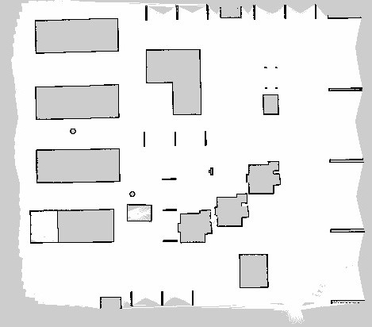

# Project-ARIA
# Autonomous Robotic Integration for Automation
## Introduction
<p align="justify">
Inefficiencies and safety risks in warehouses, healthcare, public spaces, manufacturing, infrastructure, and agriculture arise from reliance on manual and semi-automated systems. These systems lead to higher labor costs, operational delays, and errors. Advanced autonomous navigation solutions are needed to streamline operations, enhance accuracy, ensure safety, and improve scalability. Implementing such technology can significantly reduce operational costs, enhance the quality of service, and boost productivity across these sectors.

## Overview
<p align="justify">
Our solution is a ROS-based autonomous navigation robot designed for versatile applications across various industries. It utilizes advanced sensors and algorithms to navigate indoor environments such as warehouses, hospitals, public spaces, manufacturing facilities, and agricultural sites. By automating routine tasks, our robot enhances operational efficiency, reduces human error, and improves safety. Its innovative design allows for seamless integration into existing workflows, scalable deployment, and adaptability to different use cases, making it a comprehensive solution for improving productivity and service quality across multiple sectors.

## Table of Contents

- [Demo](#Demo)
- [Components](#Components-required-with-Bill-of-Materials)
- [Hardware](#Hardware)
- [Code Base](#Code-Base)
- [Technologies Used](#Technologies-Used)
- [Folder Structure](#Folder-Structure)
- [Running A.R.I.A](#Running-A.R.I.A)
- [Result](#Result)
- [Conclusions](#Conclusions)

## Demo
### Demo Videos

### Simulation Demo

https://github.com/AshishRamesh/Project-ARIA/assets/81244883/e79a8316-d9ba-47e1-9f22-4ec968c25e12

<p align="center"><b>Simulation Demo</b></p>


### Progress Images
### Simulation 

<p align="center">
  
</p>
<p align="center"><b>Fig: Image of ARIA in Simulation</b></p>

<p align="center">
  
</p>
<p align="center"><b>Fig: Image of custom warehouse</b></p>

<p align="center">
  
</p>
<p align="center"><b>Fig: Map of warehouse generated by SLAM Toolkit</b></p>

### Physical Prototype
<p align="center">
  
</p>
<p align="center"><b>Fig: Initial Prototype</b></p>

<p align="center">
  
</p>
<p align="center"><b>Fig: Custom PCB for Nano & Motor Driver</b></p>

<p align="center">
  
</p>
<p align="center"><b>Fig: ARIA Version 2 Chassis Base </b></p>

<p align="center">
  
</p>
<p align="center"><b>Fig: Physical PCB </b></p>

## Components required with Bill of Materials
### Components That are Already  Acquired / Owned :

| Component                | Quantity | Description                                                            | Links to Products                  |
|--------------------------|----------|------------------------------------------------------------------------|------------------------------------|
| Raspberry Pi 3b+         | 1        | Microprocessor Board                                                   | [Raspberry Pi 3b+](https://www.raspberrypi.org/products/raspberry-pi-3-model-b-plus/) |
| Pi cam                   | 1        | Standard Pi Cam for Surveillance                                       | [Pi camera](https://www.raspberrypi.org/products/camera-module-v2/) |
| Buck Converter           | 1        | Step down or Step up Voltage device                                    | [Buck Converter](https://www.amazon.com/LM2596-Converter-Power-Supply-Module/dp/B00C0KL1OM) |
| Li-Po battery            | 1        | 11.5V Li-Po battery for Power Requirements                             | [LiPo battery 3s](https://www.amazon.com/11-1V-2200mAh-LiPo-Battery/dp/B07RJD53Z9) |
| Lidar                    | 1        | RP Lidar A1M8 For Mapping the required area                            | [Lidar A1M8](https://www.slamtec.com/en/Lidar/A1) |
| Caster wheel             | 1        | For Smooth running and weight Balancing of the Bot                     | [Castor wheel](https://www.amazon.com/Caster-Wheels/s?k=Caster+Wheels) |
| Motor Driver             | 1        | L298N Motor Driver to Run the Motors                                   | [Motor Driver](https://www.amazon.com/HiLetgo-Controller-Stepper-Heatsink-Arduino/dp/B00J4Z6892) |
| Arduino Nano             | 1        | Microcontroller board for Sending the signal from Pi to Motor driver   | [Arduino Nano](https://store.arduino.cc/products/arduino-nano) |
| Slide Switches           | 2        | Switches for Powering Up or Down the Bot                               | [Slide Switch](https://www.amazon.com/Slide-Switches/s?k=Slide+Switches) |
| Wheels                   | 2        | To Run the Bot Forward, Reverse or in Required Direction               | [Wheels](https://www.amazon.com/Robot-Wheels/s?k=Robot+Wheels) |

### Components to be Acquired

| Component                | Quantity | Description                                                            | Links to Products                  |
|--------------------------|----------|------------------------------------------------------------------------|------------------------------------|
| Gear Motor Encoder D type| 2        | Gear motor Encoder D type to maintain or equalize the Speed of Motors  | [Encoded Motors](https://www.amazon.com/DC-Geared-Motor-Encoder-Robot/dp/B07Y3N1CVX) |
| Cooling system           | 1        | Raspberry Pi Cooling system (aluminum case with Double fans)           | [Cooling System](https://www.amazon.com/Raspberry-Aluminum-Heatsink-Cooling-Cooler/dp/B07349HT26) |

## Hardware 
### Pinout Diagram

### Table for Pin Connections

| Component                    | Pin Configuration          | Description                                                                      |
|------------------------------|----------------------------|----------------------------------------------------------------------------------|
| RP Lidar A1M8 Micro USB Port | USB Port 2                 | Lidar Connected to the Raspberry Pi’s USB Port 2                                 |
| Arduino Nano Micro USB Port  | USB Port 1                 | Nano Connected to the Raspberry Pi’s USB Port 1                                  |
| Pi camera                    | CSI Camera Port            | Camera Connected to the Raspberry Pi’s Camera port                               |
| Motor Driver control pin 1   | PD6                        | CP1 of Motor driver connection to Microcontroller Nano                           |
| Motor Driver control pin 2   | PD10                       | CP2 of Motor driver connection to Microcontroller Nano                           |
| Motor Driver control pin 3   | PD9                        | CP3 of Motor driver connection to Microcontroller Nano                           |
| Motor Driver control pin 4   | PD5                        | CP4 of Motor driver connection to Microcontroller Nano                           |
| Motor Driver 5V out          | Vin                        | Power supply to Arduino Nano from Motor Driver                                   |
| Encoder Motor1 +ve           | OUT1                       | Motor1 Connections to Driver (To run the motor)                                  |
| Encoder Motor1 -ve           | OUT2                       | Motor1 Connections to Driver                                                     |
| Encoder Motor1 VCC           | 5v out                     | Power supply for E.motor from MotorDriver                                        |
| M1 Encoder A (interrupt)     | PC4                        | Connections to pin A4 of Microcontroller to determine the Speed of motor          |
| M1 Encoder B (direction)     | PC5                        | Connections to pin A5 of Microcontroller to determine the Direction and position of Motor |
| Encoder Motor2 +ve           | OUT3                       | Motor2 Connections to Driver                                                     |
| Encoder Motor2 -ve           | OUT4                       | Motor2 Connections to Driver                                                     |
| Encoder Motor2 VCC           | 5v out                     | Power supply for E.motor from MotorDriver                                        |
| M2 Encoder A (interrupt)     | PD2                        | Connections to pin D2 of Microcontroller to determine the Speed of motor          |
| M2 Encoder B (direction)     | PD3                        | Connections to pin D3 of Microcontroller to determine the Direction and position of Motor |
| GND pins of Encoder Motors   | GND                        | Connections to GND pin of Motor driver                                           |
| Buck converter out +         | 5v Vin                     | Reduced voltage power supply from BC to Pi                                       |
| Li-Po Battery +ve            | 12v Vin of MD, In+ of BC   | Supplying equal power to both Motor Driver and BC by making it short             |
| GND Pins                     | Common Ground              | All the GND Pins are shorted to make One common Ground                           |

## Code Base

### Simulation

<p align="center">
  <a href="https://github.com/AshishRamesh/Project-ARIA/source_code/sim">View Simulation Code</a>
</p>

### ROS Arduino Bridge 

<p align="center">
  <a href="https://github.com/AshishRamesh/Project-ARIA/source_code/ros_arduino_bridge">View ROS Arduino Bridge Code</a>
</p>

### Robot Code  

<p align="center">
  <a href="https://github.com/AshishRamesh/Project-ARIA/source_code/robot">View Robot Code</a>
</p>

## Technologies Used

<div style="border: 1px solid black; padding: 10px;">

- ``ros_arduino_bridge``: Turns an Arduino into a motor controller! It provides a simple serial interface to communicate with a high-level computer running ROS, and generates the appropriate PWM signals for a motor driver, to drive two motors.
- ``ROS 2 Humble``: The Robot Operating System (ROS) 2 Humble Hawksbill, a flexible framework for writing robot software.
- `Gazebo`: A powerful robot simulation tool that allows for testing and development in a simulated environment.
- `SLAM Toolkit`: Simultaneous Localization and Mapping (SLAM) toolkit used for mapping and navigation.
- `Nav 2`: The Navigation 2 stack in ROS 2, used for autonomous navigation of robots.
- `OpenCV`: Open Source Computer Vision Library, used for image processing and computer vision tasks.
- `Rviz2`: A 3D visualization tool for ROS 2, used to visualize the state of the robot and its environment.

The assests used for the simulation world (racks , boxes etc) is from an open source platform called AWS Robomaker . The world is a custom , developed by us .

<p>
  <a href="https://github.com/aws-robotics/aws-robomaker-small-warehouse-world">View AWS Robomaker Repo</a>
</p>

</div>

## Folder Structure 

### Dev Machine Structure

```
dev_ws/
├── build/
├── install/
├── log/
└── src/
    ├── articubot_one/
    ├── serial_demo_msgs/
    └── ball_tracker/
```
### Bot Workspace Structure 

```
bot_ws/
├── build/
├── install/
├── log/
└── src/
    ├── articubot_one/
    ├── serial/
    └── different_drive_arduino/
```
## Running A.R.I.A

Source the Workspace:
```
source install/setup.bash
```

### Simulation 

Run the following on the dev machine:
```
ros2 launch articubot_one launch_sim.launch.py world:=src/articubot_one/worlds/obstacles.world 
```

### Physical Bot

##### To run the bot :

Run the following on the bot terminal:
```
ros2 launch articubot_one launch_robot.launch.py 
```

Run the following on the dev machine:
```
ros2 launch articubot_one joystick.launch.py 
```

#### To run the camera :

Run the following on the bot terminal:
```
ros2 launch articubot_one camera.launch.py
```

#### To run the lidar :

Run the following on the bot terminal:
```
ros2 launch articubot_one rplidar.launch.py

ros2 run rplidar_ros rplidar_composition --ros-args -p serial_port:=/dev/serial/by-id/usb-Silicon_Labs_CP2102_USB_to_UART_Bridge_Controller_0001-if00-port0 -p serial_baudrate:=115200 -p frame_id:=laser_frame -p angle_compensate:=true -p scan_mode:=Standard
```

### To run Autonomous features :

#### GUI in Rviz2:
```
ros2 run rviz2 rviz2 -d src/articubot_one/config/main.rviz 
```

#### SLAM Map:
```
ros2 launch slam_toolbox online_async_launch.py params_file:=./src/articubot_one/config/mapper_params_online_async.yaml
```

#### For Autonomous navigation :
```
ros2 launch nav2_bringup navigation_launch.py 
```

## Result
## Conclusions
This project aims to develop a versatile robotic system that combines autonomous and manual capabilities to enhance operational efficiency, reduce costs, improve safety, ensure accuracy, and promote sustainability across industries. 
These achievements will showcase the robot's capabilities and demonstrate its potential impact in various real-world applications.

